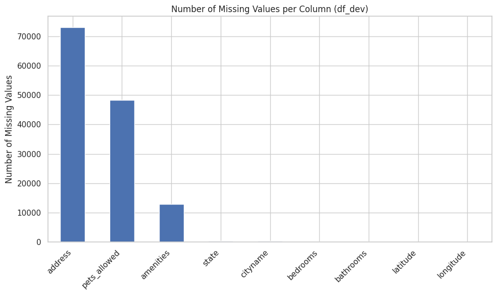
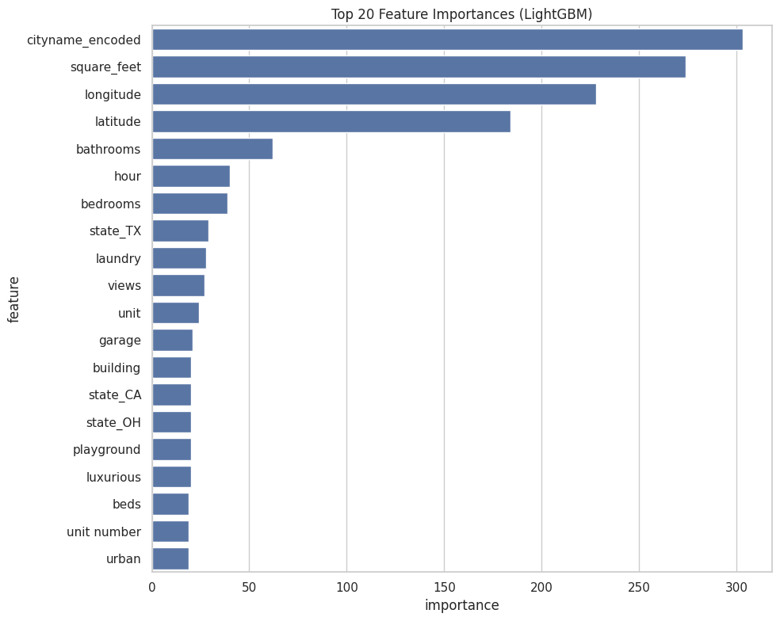
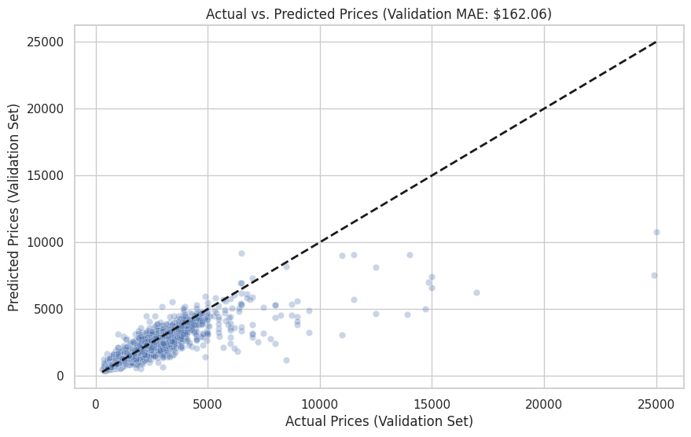
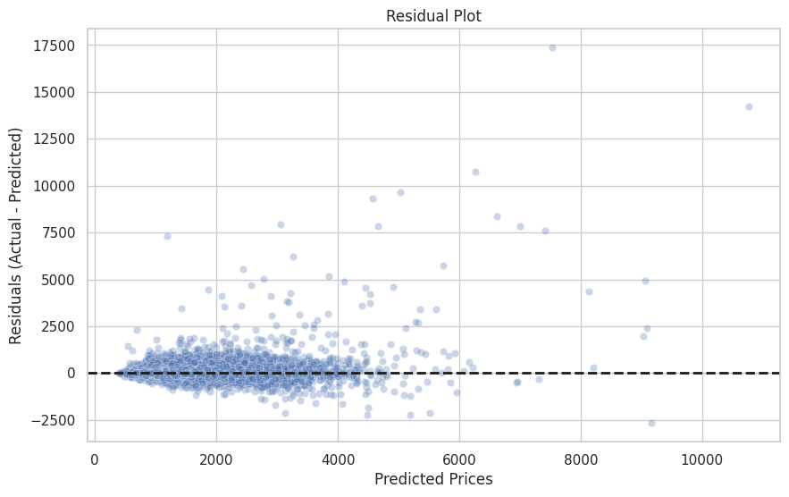

# Apartment Rent Price Prediction

A machine learning pipeline for predicting monthly apartment rental prices across the United States, developed as part of the **Data Science Lab: Process and Methods** course at Politecnico di Torino. The project applies a LightGBM regressor to ~100,000 listings with structured and text features, achieving a validation MAE of **$162.06**.

Full methodology and analysis: [`report.pdf`](report.pdf)

---

## Problem Statement

Predicting apartment rent from listing data is a regression task complicated by high-cardinality categorical features (2,800+ cities), noisy text descriptions, heavy missing values, and a right-skewed target distribution ($100 -- $52,500). Performance is evaluated using Mean Absolute Error (MAE).

## Dataset

The dataset consists of U.S. apartment rent announcements:

| Split | Samples | Target |
|---|---|---|
| Development | 79,589 | `price` (continuous) |
| Evaluation | 19,898 | -- (prediction target) |

**Feature categories:**

| Category | Examples |
|---|---|
| Numerical | `bathrooms`, `bedrooms`, `square_feet`, `latitude`, `longitude` |
| Categorical | `cityname` (2,806 unique), `state`, `pets_allowed`, `source`, `fee`, `has_photo` |
| Textual | `title`, `body`, `amenities` |
| Temporal | `time` (Unix timestamp) |

**Key data challenges:** `address` was 92% missing, `pets_allowed` ~60% missing, `amenities` ~16% missing, and `square_feet` had extreme outliers up to 40,000.



## Methodology

### 1. Data Preprocessing

| Step | Details |
|---|---|
| Column removal | `address` (92% missing), `currency`, `price_type` (single values), `category` (uninformative) |
| Time decomposition | Unix timestamp → `year`, `month`, `day`, `dayofweek`, `hour` |
| Numerical imputation | Median from development set (`bathrooms`, `bedrooms`, `latitude`, `longitude`) |
| Categorical imputation | Mode for `cityname`/`state`; "Not Specified" category for `pets_allowed` |
| Boolean conversion | `fee` and `has_photo` mapped to 0/1 |
| Outlier clipping | `square_feet` clipped at 1st/99th percentiles (~395 -- ~2,247 sq ft) |
| Target transform | `log(price + 1)` to normalize the right-skewed distribution |

### 2. Feature Engineering

| Strategy | # Features | Details |
|---|---|---|
| One-hot encoding | ~80 | `pets_allowed`, `state`, `source` |
| TF-IDF (amenities) | 200 | Comma-tokenized, bigrams, `min_df=10` |
| TF-IDF (title) | 300 | Trigrams, English stop words removed, `min_df=5` |
| TF-IDF (body) | 500 | Bigrams, English stop words removed, `min_df=10` |
| Target encoding | 1 | `cityname` via 5-fold CV to prevent leakage |

Final feature matrix: **791 sparse columns**.

### 3. Model Selection and Tuning

**LightGBM** was selected for its efficiency with sparse, high-dimensional data. The model was iteratively improved:

| Step | Validation MAE |
|---|---|
| Baseline (default LGBM, no log transform) | $245.37 |
| + Log target transform | $233.63 |
| + Title TF-IDF | $234.50 |
| + Cityname target encoding | $221.62 |
| + Body TF-IDF | $202.45 |
| + Square feet outlier clipping | $202.19 |
| + Manual hyperparameter tuning | $191.38 |
| + Early stopping (6,500 rounds) | **$162.06** |

Final hyperparameters: `n_estimators=6500`, `learning_rate=0.05`, `subsample=0.8`, `colsample_bytree=0.8`, with early stopping (`stopping_rounds=50`) on a 20% validation split.

## Results

### Feature Importance



Location (`cityname_encoded`, `longitude`, `latitude`) and size (`square_feet`) dominate. TF-IDF terms like *laundry*, *views*, *garage*, and *luxurious* from listing descriptions rank among the top 20, validating the text feature engineering.

### Prediction Quality

<p align="center">
  
  
</p>

The model tracks well for listings under ~$5,000/month. Residuals fan out for higher-priced apartments, which is expected given the heavy right tail and limited high-rent training samples.

## Pipeline Overview

```
development.csv / evaluation.csv
        │
        ▼
  Preprocessing          # Drop columns → impute → clip outliers → log transform target
        │
        ▼
Feature Engineering      # One-hot → TF-IDF (amenities, title, body) → target encode cityname
        │
        ▼
   LightGBM              # Train on sparse matrix → early stopping → validate
        │
        ▼
  submission.csv         # expm1() → clip negatives → round to 2 decimals
```

## Repository Structure

```
├── rent_prediction_pipeline.ipynb   # Full pipeline (Google Colab)
├── report.pdf                       # IEEE-format project report
├── images/
│   ├── missing_values.png
│   ├── feature_importance.png
│   ├── actual_vs_predicted.png
│   └── residual_plot.png
├── .gitignore
├── LICENSE
└── README.md
```

## Setup and Usage

**Dependencies:**

```
pip install pandas numpy scikit-learn lightgbm scipy matplotlib seaborn
```

**Run the notebook:**

1. Open [`rent_prediction_pipeline.ipynb`](rent_prediction_pipeline.ipynb) in [Google Colab](https://colab.research.google.com/)
2. Place `development.csv` and `evaluation.csv` in your Google Drive under `DSLproject/`
3. Run all cells sequentially

**Output:** `submission.csv` with columns `Id` and `Predicted`.

> **Note:** The dataset was provided as part of the DSL course at Politecnico di Torino and is not redistributed in this repository.

## Future Work

- **Advanced tuning:** Optuna for systematic hyperparameter search
- **Ensemble methods:** Stacking LightGBM with CatBoost or XGBoost
- **Deeper NLP:** Pre-trained embeddings (Word2Vec, BERT) for richer text representations
- **Geospatial features:** Distance to city centers, transit hubs, points of interest
- **K-Fold CV training:** Reduce variance from a single train/val split

## Authors

**Ayda Ghasemazar** · **Hasti Azadnia**
MSc Data Science and Engineering -- Politecnico di Torino

## License

[MIT](LICENSE)
